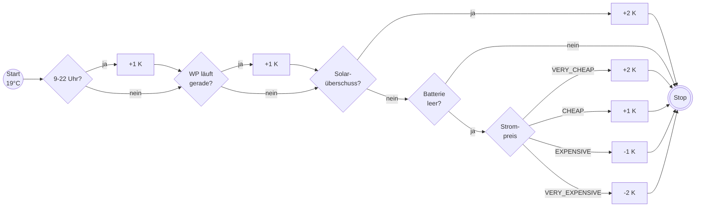

## Dynamische Leistungsanpassung

Wer

- einen dynamischen Stromtarif, z.B. von Tibber,
- eine PV-Anlage und
- einen Heimspeicher

hat, für den könnte folgende Steuerung vielleicht interessant sein:

