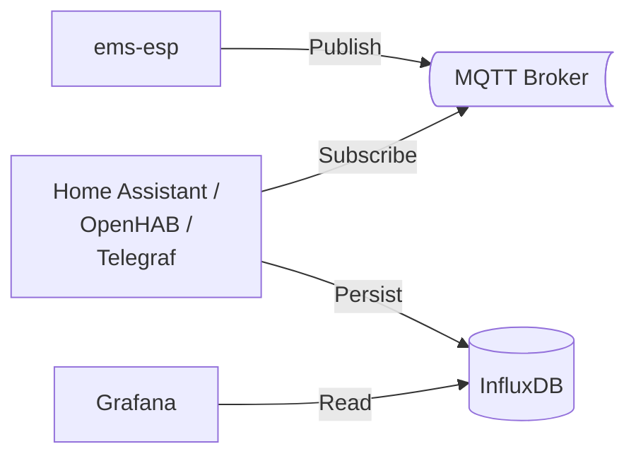

Nachfolgend findet ihr eine Anleitung, wie ihr die Bosch CS5800/6800i oder Buderus WLW176/186 in freie Smarthome-Systeme wie [OpenHAB](https://www.openhab.org/) oder [Home Assistant](https://www.home-assistant.io/) integrieren könnt.
Zusätzlich wird beschrieben, wie man die Messwerte in [Grafana](https://grafana.com) visualisiert.

## EMS-ESP

Die Bosch/Buderus Wärmepumpen bieten leider keine offizielle Schnittstelle an, um Messwerte abzurufen oder Einstellungen vorzunehmen.

Glücklicherweise gibt es das open-source Projekt [ems-esp](https://emsesp.org).
Wer die Hardware nicht selbst basteln möchte, kann bereits mit _ems-esp_ geflashte Hardware von [BBQKees](https://bbqkees-electronics.nl/?lang=de) beziehen.
Ich habe mich für das [ BBQKees Gateway S3](https://bbqkees-electronics.nl/product/gateway-s3-standard-wifi-ausgabe/?lang=de) entschieden.

<figure class="half">
  <a href="/assets/images/BBQKees-Gateway-S3.jpg">
    
  </a>
  <a href="/assets/images/Servicebuchse.jpg">
    
  </a>
</figure>

Nachdem man die Hardware an die Servicebuchse der Inneneinheit angesteckt und das WLAN konfiguriert hat, kann man Daten über die Weboberfläche unter [http://ems-esp](http://ems-esp) oder über die REST API auslesen:

```shell
curl http://ems-esp/api/thermostat/manualtemp
> {"name":"manualtemp","fullname":"HK1 manuelle Temperatur","circuit":"hc1","value":21.5,"type":"number","min":0,"max":127,"uom":"°C","readable":true,"writeable":true,"visible":true}
```

[](/assets/images/EMS-ESP.png)

Leider tritt bei manchen Nutzern sporadisch ein Verbindungsproblem auf, das hoffentlich bald gelöst wird (siehe [
Bosch Heat Pump error: No communication on EMS bus](https://github.com/emsesp/EMS-ESP32/issues/2104)).

### Entitäten

In der Weboberfläche werden direkt alle erkannten Geräte angezeigt:

- **XCU_THH/CS\*800i, Logatherm WLW\*** (Boiler) mit 173 Entitäten
- **HMI800.2/Rego 3000, UI800, Logamatic BC400** (Thermostat) mit 71 Entitäten
- **K30RF/WiFi module** (Gateway Module)

Unter [Smarthome Entitäten](/docs/smarthome/entities) ist eine Liste aller aktuell verfügbaren Entitäten zu finden.

## MQTT

Für den Datenaustausch zwischen _ems-esp_ und einem Smarthome-System bietet sich MQTT an.
Dazu braucht man einen MQTT-Broker, wie [Mosquitto](https://mosquitto.org/), der in vielen Smarthome-Systemen bereits als optionale Erweiterung mitgeliefert wird.
In Home Assistant und OpenHAB kann Mosquitto leicht über das entsprechende [Add-on](https://github.com/home-assistant/addons/blob/master/mosquitto/DOCS.md) installiert werden.



Damit _ems-esp_ die Messwerte an den MQTT-Broker schickt, müsst ihr dies unter _Settings &rarr; MQTT&nbsp;Settings_ aktivieren und die _Broker Address_, sowie _Username_ und _Password_ hinterlegen.
Außerdem sollte man _Enable MQTT Discovery_ aktivieren, denn sonst muss man alle Entitäten händisch anlegen.

[](/assets/images/EMS-ESP-MQTT.png)

Falls ihr noch keinen MQTT-Broker habt, dann funktioniert die Kommunikation natürlich erst, wenn ihr euer Smarthome mit dem MQTT-Addon installiert habt.
Mehr dazu in den nachfolgenden Abschnitten.

## Home Assistant

### Einbinden von ems-esp

Nach erfolgreicher [Installation](https://www.home-assistant.io/installation) von Home Assistant, erhält man folgenden Onboarding-Screen.

[](/assets/images/HA-Onboarding.png)

Mit Klick auf _MEIN SMARTHOME ERSTELLEN_ wird man aufgefordert ein Benutzerkonto anzulegen und eine Adresse auszuwählen.
Im nächsten Schritt kann man Home Assistant optionale Telemetriedaten zur Verfügung stellen.
Im letzten Schritt werden Geräte angezeigt, die Home Assistant bereits während der Installation im Heimnetz identifizieren konnte - z.B. Fritzbox und Smart Plugs von Shelly.

Home Assistant kann _ems-esp_ nicht direkt identifizieren.
Dies lässt sich schnell ändern, indem man _Integration hinzufügen_ unter _Einstellungen &rarr; Geräte & Dienste_ auswählt.
In der Anbietersuche gibt man _MQTT_ ein.

[](/assets/images/HA-MQTT.png)

Daraufhin öffnet sich ein Dialog, indem man das _offizielle Add-on Mosquitto Mqtt Broker_ installieren kann.
Hat man die MQTT-Integration erfolgreich aufgeschlossen, so erhält man eine Übersicht aller über das MQTT-Discovery identifizierten Geräte:

- ems-esp Boiler = Wärmepumpe
- ems-esp = Gateway Module
- ems-esp Thermostat = Thermostat

Nach Bestätigung gelangt man zurück zur Übersicht, in der nun alle verfügbaren Entitäten dargestellt werden.

[](/assets/images/HA-Overview.png)

Ein detailliertere Installationsanleitung kann man auch direkt bei [ems-esp](https://bbqkees-electronics.nl/wiki-archive/gateway/home-assistant-configuration.html) finden.

### Messwerteverlauf visualisieren

Und dann kann es auch schon mit den ersten Messwerten losgehen!
Um die Funktionsweise der Wärmepumpe genauer zu verstehen und die Effizienz zu überwachen, macht es Sinn, sich einige Messwerte grafisch darstellen zu lassen.
Mit Klick auf [_Verlauf_](https://my.home-assistant.io/redirect/history/) im Menü links kann man _Entitäten auswählen_, deren Verlauf man angezeigt bekommen möchte.
Im nachfolgenden Verlauf werden die folgenden Messwerte dargestellt:

- _Boiler Gewählte Vorlauftemperatur_: die gewünschte Vorlauftemperatur, die sich aus der [eingestellten Heizkurve](/docs/einstellungen#heizkurve) und der Außentemperatur ergibt.
  Im dargestellten Beispiel lag die Außentemperatur bei -2..-4 °C und die Sollvorlauftemperatur bei 32..35 °C.
- _Boiler Aktuelle Vorlauftemperatur_: die reale Vorlauftemperatur, die wie im Diagramm zu sehen um die gewählte Vorlauftemperatur schwingt.
  Die Ausreißer nach unten sind [Abtauvorgänge](/docs/technischer-aufbau/#abtauvorgang), da die Luftfeuchtigkeit bei ca. 90% lag.

[](/assets/images/HA-History_FlowTemp.png)

[](http://homeassistant.local:8123/history?entity_id=sensor.boiler_curflowtemp%2Cnumber.boiler_selflowtemp)

### Arbeitszahl/COP mit Helfer-Entitäten

Interessante Einsicht in die Effizienz der Anlage bietet insbesondere die Arbeitszahl, die manchmal auch als COP bezeichnet wird.
Die Arbeitszahl ist nicht direkt über _ems-esp_ verfügbar, kann aber einfach eingerichtet werden.
Die Arbeitszahl ist der Quotient aus thermischen Leistungsabgabe _Q_ und der elektrischen Leistungsaufnahme _P_.
Zur Berechnung benötigt man 3 [Helfer-Entitäten](https://my.home-assistant.io/redirect/helpers/):

<figure class="third">
  <a href="/assets/images/HA-Helper_PowerTotal.png">
  </a>
  <a href="/assets/images/HA-Helper_PowerConsTotal.png">
  </a>
  <a href="/assets/images/HA-Helper_Arbeitszahl.png">
  </a>
</figure>

1. **Thermische Leistungsabgabe** als _Ableitungssensor_ der thermischen Energie
   - Art: Helfer &rarr; Ableitungssensor
   - Name: _boiler_powertotal_
   - Eingangssensor: _ems-esp Boiler Gesamtenergie_
   - Genauigkeit: _2_ decimals
   - Zeitfenster: mindestens _10 Minuten_, um die Messungenauigkeit etwas zu glätten
   - Zeiteinheit: _Stunden_
2. **Elektrische Leistungsaufnahme** als _Ableitungssensor_ der elektrischen Energie
   - Art: Helfer &rarr; Ableitungssensor
   - Name: _boiler_powerconstotal_
   - Eingangssensor: _ems-esp Boiler Gesamtmessung_
   - Genauigkeit: _2_ decimals
   - Zeitfenster: mindestens _10 Minuten_, um die Messungenauigkeit etwas zu glätten
   - Zeiteinheit: _Stunden_
3. **Arbeitszahl** als _Template für einen Sensor_
   - Art: Helfer &rarr; Template &rarr; Template für einen Sensor
   - Name: _boiler_az_
   - Zustandstemplate:
     
     ```
     
     
     
     {{ (q / p) | round(2) }}
     
       0
     
     ```
     
   - Geräteklasse: _Leistungsfaktor_
   - Gerät: _ems-esp Boiler_

Wie bereits oben für den Vorlauf beschrieben, können wir die 3 neuen Helfer-Entitäten auch über einen frei wählbaren Zeitraum im Verlauf betrachten:

[](/assets/images/HA-History_Arbeitszahl.png)

[](http://homeassistant.local:8123/history?entity_id=sensor.boiler_powerconstotal%2Csensor.boiler_powertotal%2Csensor.boiler_cop)

Das Diagramm zeigt die 3 Helfer-Entitäten bei -5 °C Außentemperatur.
Die elektrische Leistungsaufnahme schwankt zwischen 530 W und 1600 W.
Mit Hilfe der Umgebungswärme werden daraus zwischen 2000 W und 4700 W gewonnen.
Die Arbeitszahl liegt bei ca. 3 im Normalbetrieb, und fällt stark ab, wenn der Abtauvorgang einsetzt, da thermische Energie zum Abtauen "verloren" geht.

Vermutlich wollt ihr aber nicht nur die aktuelle Arbeitszahl sehen, sondern diese auch über die gesamte Laufzeit eurer Wärmepumpe auswerten.
Dazu legt ihr euch einfach eine weitere Helfer-Entität für die **Jahresarbeitszahl** an:

- Art: Helfer &rarr; Template &rarr; Template für einen Sensor
- Name: _boiler_jaz_
- Zustandstemplate:
  
  ```
  
  
  
  {{ (q / p) | round(2) }}
  
    0
  
  ```
  
- Geräteklasse: _Leistungsfaktor_
- Gerät: _ems-esp Boiler_

### Wärmepumpen Dashboard

Um auf einen Blick alle relevanten Messwerte zu erhalten, empfiehlt es sich im nächsten Schritt ein Dashboard zu erstellen.
Ein einfaches Dashboard für die Wärmepumpte sieht beispielsweise so aus:

[](/assets/images/HA-SimpleDashboard.png)

Die Konfiguration für dieses Dashboard findet ihr hier: [https://github.com/bosch-buderus-wp/home-assistant/blob/main/dashboards/simple-dashboard.yaml](https://github.com/bosch-buderus-wp/home-assistant/blob/main/dashboards/simple-dashboard.yaml).
Um die Konfiguration zu übernehmen, erstellt euch einfach ein neues Dashboard in der Dashboard-Übersicht:

[](https://my.home-assistant.io/redirect/lovelace_dashboards/)

und klickt dann oben rechts auf den Stift, dann auf die 3 Punkte und dann auf _Raw-Konfigurationseditor_.
Dort könnt ihr dann die Konfiguration reinkopieren, speichern und das Dashboard direkt nutzen.

Weitere Details folgen in Kürze.

## OpenHAB

Wurde OpenHAB über [OpenHABian](https://www.openhab.org/docs/installation/openhabian.html) installiert, kann Mosquitto über `sudo openhabian-config` -> `20 | Optional Components` installiert werden.
Dann muss man noch das [MQTT Binding](https://www.openhab.org/addons/bindings/mqtt/) hinzufügen und durch das Auto-Discovery werden alle Entitäten als _Things_ automatisch erkannt.
Alternativ kann man alle oder ausgewählte Entitäten manuell als _Thing_ anlegen.

<details>
    <summary>mqtt.things</summary>


```java
Bridge mqtt:broker:myMQTTBroker "My MQTT server"
[
    host="192.168.178.20",
    clientID="myMQTTClient"
]

Thing mqtt:topic:emsesp "Heatpump" (mqtt:broker:myMQTTBroker) [ availabilityTopic="ems-esp/status", payloadAvailable="online", payloadNotAvailable="offline" ] {
Channels:
Type number : TxFails "TX Fails" [stateTopic="ems-esp/heartbeat", transformationPattern="JSONPATH:$.txfails"]
Type number : NrgTotal "Energy Total" [stateTopic="ems-esp/boiler_data", transformationPattern="JSONPATH:$.nrgtotal"]
Type number : NrgWwTotal "Energy Warm Water Total" [stateTopic="ems-esp/boiler_data", transformationPattern="JSONPATH:$.dhw.nrg"]
Type number : NrgHeatingTotal "Energy Heating Total" [stateTopic="ems-esp/boiler_data", transformationPattern="JSONPATH:$.nrgsuppheating"]
Type number : MeterTotal "Meter Total" [stateTopic="ems-esp/boiler_data", transformationPattern="JSONPATH:$.metertotal"]
Type number : PowerCons "Power Consumption" [stateTopic="ems-esp/boiler_data", transformationPattern="JSONPATH:$.hppower"]
Type number : NrgConsHeatingTotal "Energy Consumption Heating Total" [stateTopic="ems-esp/boiler_data", transformationPattern="JSONPATH:$.nrgconscompheating"]
Type number : NrgConsWarmWaterTotal "Energy Consumption Warm Water Total" [stateTopic="ems-esp/boiler_data", transformationPattern="JSONPATH:$.dhw.meter"]
Type number : Modulation "Modulation" [stateTopic="ems-esp/boiler_data", transformationPattern="JSONPATH:$.curburnpow"]
Type number : OutdoorTemp "Outdoor Temperature" [stateTopic="ems-esp/boiler_data", transformationPattern="JSONPATH:$.outdoortemp"]
Type number : SelectedFlowTemp "Selected Flow Temperature" [stateTopic="ems-esp/boiler_data", transformationPattern="JSONPATH:$.selflowtemp"]
Type number : CurrFlowTemp "Current Flow Temperature" [stateTopic="ems-esp/boiler_data", transformationPattern="JSONPATH:$.curflowtemp"]
Type number : ReturnTemp "Return Temperature" [stateTopic="ems-esp/boiler_data", transformationPattern="JSONPATH:$.rettemp"]
Type number : CarrierReturn "Heat Carrier Return (TC0)" [stateTopic="ems-esp/boiler_data", transformationPattern="JSONPATH:$.hptc0"]
Type number : CarrierForward "Heat Carrier Forward (TC1)" [stateTopic="ems-esp/boiler_data", transformationPattern="JSONPATH:$.hptc1"]
Type number : CondenserTemp "Condenser Temperature (TC3)" [stateTopic="ems-esp/boiler_data", transformationPattern="JSONPATH:$.hptc3"]
Type number : CondenserReturnTemp "Condenser Return Temperature (TR3)" [stateTopic="ems-esp/boiler_data", transformationPattern="JSONPATH:$.hptr3"]
Type number : EvaporatorTemp "Evaporator Temperature (TR5)" [stateTopic="ems-esp/boiler_data", transformationPattern="JSONPATH:$.hptr5"]
Type number : EvaporatorReturnTemp "Evaporator Return Temperature (TR4)" [stateTopic="ems-esp/boiler_data", transformationPattern="JSONPATH:$.hptr4"]
Type number : AirInletTemp "Air Inlet Temperature (TL2)" [stateTopic="ems-esp/boiler_data", transformationPattern="JSONPATH:$.hptl2"]
Type number : CurrWarmWaterTemp "Current Warm Water Temperature" [stateTopic="ems-esp/boiler_data", transformationPattern="JSONPATH:$.dhw.curtemp"]
Type number : RoomSetpointTemp "Room Setpoint Temperature" [stateTopic="ems-esp/thermostat_data", transformationPattern="JSONPATH:$.hc1.seltemp"]
Type string : HeatingActive "Heating Active" [stateTopic="ems-esp/boiler_data", transformationPattern="JSONPATH:$.heatingactive"]
Type string : WarmWaterActive "Warm Water Active" [stateTopic="ems-esp/boiler_data", transformationPattern="JSONPATH:$.tapwateractive"]
Type string : WarmWaterMode "Warm Water Mode" [stateTopic="ems-esp/thermostat_data", transformationPattern="JSONPATH:$.dhw.mode"]
}

```


{{ mqtt_things | markdownify }}

</details>

Weitere Details folgen in Kürze.

## InfluxDB & Grafana

Wer die Daten lieber mit [Grafana](https://grafana.com) visualisieren möchte, kann die Daten entweder über Home Assistant oder OpenHAB oder alternativ über [Telegraf](https://www.influxdata.com/integration/mqtt-telegraf-consumer/) in eine [InfluxDB](https://www.influxdata.com/) schreiben, auf die dann Grafana zugreift.

[](/assets/images/GrafanaLeistungZurAT.png)

[](/assets/images/Grafana-Circuits.png)

Weitere Details folgen in Kürze.
