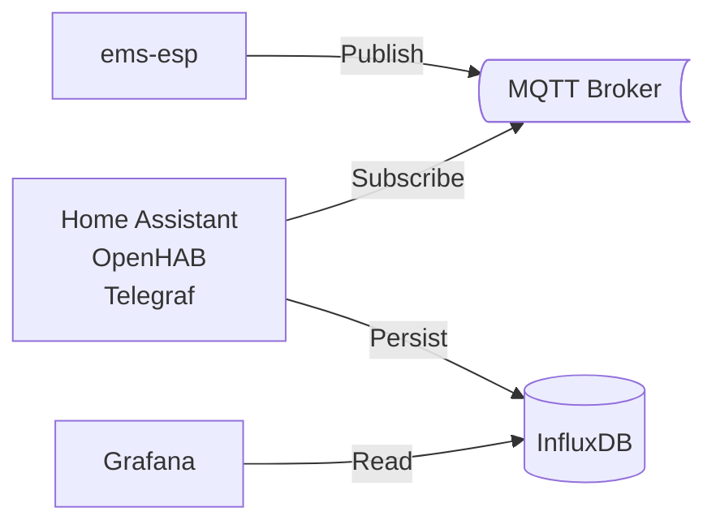

Nachfolgend findet ihr eine Anleitung, wie ihr die Bosch CS5800/6800i oder Buderus WLW176/186 in freie Smarthome-Systeme wie [OpenHAB](https://www.openhab.org/) oder [Home Assistant](https://www.home-assistant.io/) integrieren könnt.
Zusätzlich wird beschrieben, wie man die Messwerte in [Grafana](https://grafana.com) visualisiert.

## EMS-ESP

Die Bosch/Buderus Wärmepumpen bieten leider keine offizielle Schnittstelle an, um Messwerte abzurufen oder Einstellungen vorzunehmen.

Glücklicherweise gibt es das open-source Projekt [ems-esp](https://emsesp.org).
Wer die Hardware nicht selbst basteln möchte, kann bereits mit ems-esp geflashte Hardware von [BBQKees](https://bbqkees-electronics.nl/?lang=de) beziehen.
Ich habe mich für das [ BBQKees Gateway S3](https://bbqkees-electronics.nl/product/gateway-s3-standard-wifi-ausgabe/?lang=de) entschieden.

<figure class="half">
  <a href="/assets/images/BBQKees-Gateway-S3.jpg">
    
  </a>
  <a href="/assets/images/Servicebuchse.jpg">
    
  </a>
</figure>

Nachdem man die Hardware an die Servicebuchse der Inneneinheit angesteckt und das WLAN konfiguriert hat, kann man Daten über die Weboberfläche unter [http://ems-esp](http://ems-esp) oder über die REST API auslesen:

```shell
curl http://ems-esp/api/thermostat/manualtemp
```

[](/assets/images/EMS-ESP.png)

Leider tritt bei manchen Nutzern sporadisch ein Verbindungsproblem auf, das hoffentlich bald gelöst wird (siehe [
Bosch Heat Pump error: No communication on EMS bus](https://github.com/emsesp/EMS-ESP32/issues/2104)).

### Entitäten

In der Weboberfläche werden direkt alle erkannten Geräte angezeigt:

- **XCU_THH/CS\*800i, Logatherm WLW\*** (Boiler) mit 173 Entitäten
- **HMI800.2/Rego 3000, UI800, Logamatic BC400** (Thermostat) mit 71 Entitäten
- **K30RF/WiFi module** (Gateway Module)

Mit Klick auf ein Gerät sieht man die verfügbaren Entitäten.

<details>
  <summary>Übersicht aller 173 Boiler-Entitäten</summary>

| Entitätsname                                | Wert            | Einheit | Schreibbar | Wertebereich                                                                   |
| ------------------------------------------- | --------------- | ------- | ---------- | ------------------------------------------------------------------------------ |
| reset                                       |                 |         | yes        | - \| maintenance \| error \| history \| message                                |
| force heating off                           | off             |         | yes        | off \| on                                                                      |
| heating active                              | on              |         | no         |                                                                                |
| tapwater active                             | off             |         | no         |                                                                                |
| selected flow temperature                   | 27              | C       | yes        | 0, 90                                                                          |
| heating pump modulation                     | 25              |         | no         |                                                                                |
| outside temperature                         | 8.8             | C       | no         |                                                                                |
| current flow temperature                    | 27              | C       | no         |                                                                                |
| return temperature                          | 24.8            | C       | no         |                                                                                |
| system pressure                             | 1.5             | bar     | no         |                                                                                |
| low loss header                             | 0               | C       | no         |                                                                                |
| heating activated                           | on              |         | yes        | off \| on                                                                      |
| heating temperature                         | 75              | C       | yes        | 0, 90                                                                          |
| heating pump                                | on              |         | no         |                                                                                |
| boiler pump max power                       | 0               |         | yes        | 0, 100                                                                         |
| boiler pump min power                       | 0               |         | yes        | 0, 100                                                                         |
| boiler pump characteristic                  | proportional    |         | yes        | proportional \| 150mbar \| 200mbar \| 250mbar \| 300mbar \| 350mbar \| 400mbar |
| burner selected max power                   | 0               |         | yes        | 0, 254                                                                         |
| burner current power                        | 26              |         | no         |                                                                                |
| burner starts                               | 0               |         | no         |                                                                                |
| total burner operating time                 | 0               | minutes | no         |                                                                                |
| burner stage 2 operating time               | 0               | minutes | no         |                                                                                |
| total heat operating time                   | 0               | minutes | no         |                                                                                |
| burner starts heating                       | 0               |         | no         |                                                                                |
| total UBA operating time                    | 283,182         | minutes | no         |                                                                                |
| emergency operation                         | off             |         | yes        | off \| on                                                                      |
| emergency temperature                       | 0               | C       | yes        | 0, 70                                                                          |
| total energy                                | 2,273           | kWh     | no         |                                                                                |
| dhw energy                                  | 1,055           | kWh     | no         |                                                                                |
| energy heating                              | 1,218           | kWh     | no         |                                                                                |
| energy cooling                              | 0               | kWh     | no         |                                                                                |
| meter total                                 | 696             | kWh     | no         |                                                                                |
| meter compressor                            | 695             | kWh     | no         |                                                                                |
| meter e-heater                              | 0               | kWh     | no         |                                                                                |
| meter heating                               | 414             | kWh     | no         |                                                                                |
| meter cooling                               | 0               | kWh     | no         |                                                                                |
| dhw meter                                   | 280             | kWh     | no         |                                                                                |
| heatpump total uptime                       | 329,886         | minutes | no         |                                                                                |
| total operating time heat                   | 57,452          | minutes | no         |                                                                                |
| operating time compressor heating           | 41,419          | minutes | no         |                                                                                |
| operating time compressor cooling           | 0               | minutes | no         |                                                                                |
| dhw operating time compressor               | 16,033          | minutes | no         |                                                                                |
| operating time compressor pool              | 0               | minutes | no         |                                                                                |
| total compressor control starts             | 529             |         | no         |                                                                                |
| heating control starts                      | 357             |         | no         |                                                                                |
| cooling control starts                      | 0               |         | no         |                                                                                |
| dhw control starts2                         | 172             |         | no         |                                                                                |
| pool control starts                         | 0               |         | no         |                                                                                |
| total energy consumption                    | 696             | kWh     | no         |                                                                                |
| total energy consumption compressor         | 695             | kWh     | no         |                                                                                |
| energy consumption compressor heating       | 414             | kWh     | no         |                                                                                |
| dhw energy consumption compressor           | 280             | kWh     | no         |                                                                                |
| energy consumption compressor cooling       | 0               | kWh     | no         |                                                                                |
| total aux elec. heater energy consumption   | 0               | kWh     | no         |                                                                                |
| aux elec. heater energy consumption heating | 0               | kWh     | no         |                                                                                |
| dhw aux elec. heater energy consumption     | 0               | kWh     | no         |                                                                                |
| aux elec. heater energy consumption pool    | 0               | kWh     | no         |                                                                                |
| total energy supplied                       | 2,273           | kWh     | no         |                                                                                |
| total energy supplied heating               | 1,218           | kWh     | no         |                                                                                |
| dhw total energy warm supplied              | 1,055           | kWh     | no         |                                                                                |
| total energy supplied cooling               | 0               | kWh     | no         |                                                                                |
| compressor power output                     | 0.4             | kW      | no         |                                                                                |
| pv compressor max power                     | 0               | kW      | yes        | 0, 25                                                                          |
| power reduction                             | 50              |         | yes        | 30, 60                                                                         |
| set differential pressure                   | 250             | mbar    | yes        | 150, 750                                                                       |
| hp compressor                               | on              |         | no         |                                                                                |
| compressor activity                         | heating         |         | no         |                                                                                |
| brine pump speed                            | 0               |         | no         |                                                                                |
| switch valve                                | off             |         | no         |                                                                                |
| compressor speed                            | 26              |         | no         |                                                                                |
| circulation pump speed                      | 25              |         | no         |                                                                                |
| brine in/evaporator                         | 0               | C       | no         |                                                                                |
| brine out/condenser                         | 0               | C       | no         |                                                                                |
| heat carrier return (TC0)                   | 24.8            | C       | no         |                                                                                |
| heat carrier forward (TC1)                  | 27.4            | C       | no         |                                                                                |
| condenser temperature (TC3)                 | 27.3            | C       | no         |                                                                                |
| compressor temperature (TR1)                | 37.6            | C       | no         |                                                                                |
| refrigerant temperature liquid side (TR3)   | 26.2            | C       | no         |                                                                                |
| evaporator inlet temperature (TR4)          | -9.8            | C       | no         |                                                                                |
| compressor inlet temperature (TR5)          | -4.5            | C       | no         |                                                                                |
| compressor outlet temperature (TR6)         | 42.5            | C       | no         |                                                                                |
| refrigerant temperature gas side (TR7)      | 0               | C       | no         |                                                                                |
| air inlet temperature (TL2)                 | 7.1             | C       | no         |                                                                                |
| low pressure side temperature (PL1)         | -10.7           | C       | no         |                                                                                |
| high pressure side temperature (PH1)        | 26.6            | C       | no         |                                                                                |
| drain pan temp (TA4)                        | 4.7             | C       | no         |                                                                                |
| reservoir temp (TW1)                        | 46.6            | C       | no         |                                                                                |
| 4-way valve (VR4)                           | heating & dhw   |         | no         |                                                                                |
| input 1 state                               | off             |         | no         |                                                                                |
| input 1 options                             | 000000000000000 |         | yes        | inv [evu1, evu2, evu3, comp, aux, cool, heat, dhw, pv]                         |
| input 2 state                               | off             |         | no         |                                                                                |
| input 2 options                             | 000000000000000 |         | yes        | inv [evu1, evu2, evu3, comp, aux, cool, heat, dhw, pv]                         |
| input 3 state                               | off             |         | no         |                                                                                |
| input 3 options                             | 100000000000000 |         | yes        | inv [evu1, evu2, evu3, comp, aux, cool, heat, dhw, pv]                         |
| input 4 state                               | off             |         | no         |                                                                                |
| input 4 options                             | 000000000000    |         | yes        | inv [comp, aux, cool, heat, dhw, pv]                                           |
| heat limit compressor                       | 0 kW            |         | yes        | 0 kW \| 2 kW \| 3 kW \| 4 kW \| 6 kW \| 9 kW                                   |
| heat limit heating                          | 3 kW            |         | yes        | 0 kW \| 2 kW \| 3 kW \| 4 kW \| 6 kW \| 9 kW                                   |
| dhw heat limit                              | 3 kW            |         | yes        | 0 kW \| 2 kW \| 3 kW \| 4 kW \| 6 kW \| 9 kW                                   |
| manual defrost                              | on              |         | yes        | off \| on                                                                      |
| cooling only with PV                        | off             |         | yes        | off \| on                                                                      |
| aux heater only                             | off             |         | yes        | off \| on                                                                      |
| disable aux heater                          | on              |         | yes        | off \| on                                                                      |
| aux heater status                           | 0               |         | no         |                                                                                |
| aux heater on delay                         | 300             | Kmin    | yes        | 10, 1000                                                                       |
| aux heater max limit                        | 2               | K       | yes        | 0, 10                                                                          |
| aux heater limit start                      | 2               | K       | yes        | 0, 10                                                                          |
| aux heater mode                             | eco             |         | yes        | eco \| comfort                                                                 |
| on/off hyst heat                            | 0               | Kmin    | yes        | 0, 1500                                                                        |
| on/off hyst cool                            | 0               | Kmin    | yes        | 0, 1500                                                                        |
| on/off hyst pool                            | 1,125           | Kmin    | yes        | 50, 1500                                                                       |
| silent mode                                 | off             |         | yes        | off \| auto \| on                                                              |
| silent mode from                            | 1,320           | minutes | yes        | 0, 3810                                                                        |
| silent mode to                              | 360             | minutes | yes        | 0, 3810                                                                        |
| min outside temp for silent mode            | -10             | C       | yes        | -126, 126                                                                      |
| outside temp parallel mode                  | -7              | C       | yes        | -126, 126                                                                      |
| aux heater mixing valve                     | 0               |         | no         |                                                                                |
| temp diff TC3/TC0 heat                      | 4.5             | K       | yes        | 2, 10                                                                          |
| temp diff TC3/TC0 cool                      | 3               | K       | yes        | 2, 10                                                                          |
| valve/pump cooling                          | off             |         | yes        | off \| on                                                                      |
| heating cable                               | off             |         | yes        | off \| on                                                                      |
| VC0 valve                                   | off             |         | yes        | off \| on                                                                      |
| primary heatpump                            | off             |         | yes        | off \| on                                                                      |
| primary heatpump modulation                 | 0               |         | yes        | 0, 100                                                                         |
| 3-way valve                                 | off             |         | yes        | off \| on                                                                      |
| el. heater step 1                           | off             |         | yes        | off \| on                                                                      |
| el. heater step 2                           | off             |         | yes        | off \| on                                                                      |
| el. heater step 3                           | off             |         | yes        | off \| on                                                                      |
| condensate reservoir heating (EA0)          | off             |         | no         |                                                                                |
| primary heatpump mode                       | auto            |         | yes        | auto \| continuous                                                             |
| shutdown                                    |                 |         | yes        | off \| on                                                                      |
| Flow PC0                                    | 329             | lh      | no         |                                                                                |
| Flow PC1                                    | 0               | lh      | no         |                                                                                |
| PC1                                         | on              |         | no         |                                                                                |
| PC1 rate                                    | 0               |         | no         |                                                                                |
| dhw alternating operation                   | off             |         | yes        | off \| on                                                                      |
| dhw prioritize heating during dhw           | 30              | minutes | yes        | 20, 120                                                                        |
| dhw prioritize dhw during heating           | 120             | minutes | yes        | 30, 120                                                                        |
| dhw eco+ switch off                         | 0               | C       | yes        | 0, 63                                                                          |
| dhw comfort diff                            | 7               | K       | yes        | 6, 12                                                                          |
| dhw eco diff                                | 7               | K       | yes        | 6, 12                                                                          |
| dhw eco+ diff                               | 7               | K       | yes        | 6, 12                                                                          |
| dhw comfort stop temp                       | 50              | C       | yes        | 0, 254                                                                         |
| dhw eco stop temp                           | 47              | C       | yes        | 0, 254                                                                         |
| dhw eco+ stop temp                          | 40              | C       | yes        | 0, 254                                                                         |
| dhw circulation pump available during dhw   | off             |         | yes        | off \| on                                                                      |
| dhw set temperature                         | 40              | C       | no         |                                                                                |
| dhw selected temperature                    | 45              | C       | yes        | 0, 254                                                                         |
| dhw selected lower temperature              | 40              | C       | yes        | 0, 254                                                                         |
| dhw selected eco+ temperature               | 33              | C       | yes        | 0, 254                                                                         |
| dhw single charge temperature               | 53              | C       | yes        | 0, 254                                                                         |
| dhw comfort mode                            | high comfort    |         | yes        | high comfort \| eco                                                            |
| dhw flow temperature offset                 | 0               | C       | yes        | 0, 100                                                                         |
| dhw charge optimization                     | off             |         | yes        | off \| on                                                                      |
| dhw maximum temperature                     | 0               | C       | yes        | 0, 80                                                                          |
| dhw circulation pump available              | off             |         | yes        | off \| on                                                                      |
| dhw hysteresis on temperature               | 0               | C       | yes        | -126, 126                                                                      |
| dhw hysteresis off temperature              | 0               | C       | yes        | -126, 126                                                                      |
| dhw disinfection temperature                | 70              | C       | yes        | 60, 80                                                                         |
| dhw circulation pump mode                   | 3x3min          |         | yes        | off \| 1x3min \| 2x3min \| 3x3min \| 4x3min \| 5x3min \| 6x3min \| continuous  |
| dhw circulation active                      | off             |         | yes        | off \| on                                                                      |
| dhw current intern temperature              | 46.5            | C       | no         |                                                                                |
| dhw current extern temperature              | 46.5            | C       | no         |                                                                                |
| dhw current tap water flow                  | 0               | lmin    | no         |                                                                                |
| dhw activated                               | on              |         | yes        | off \| on                                                                      |
| dhw one time charging                       | off             |         | yes        | off \| on                                                                      |
| dhw disinfecting                            | off             |         | yes        | off \| on                                                                      |
| dhw charging                                | off             |         | no         |                                                                                |
| dhw recharging                              | off             |         | no         |                                                                                |
| dhw temperature ok                          | off             |         | no         |                                                                                |
| dhw 3-way valve active                      | off             |         | no         |                                                                                |
| dhw starts                                  | 0               |         | no         |                                                                                |
| dhw active time                             | 0               | minutes | no         |                                                                                |

{{ entities_boiler | markdownify }}
</details>

<details>
  <summary>Übersicht aller 71 Thermostat-Entitäten</summary>

| Entitätsname                                | Wert                | Einheit | Schreibbar | Wertebereich                                                                 |
| ------------------------------------------- | ------------------- | ------- | ---------- | ---------------------------------------------------------------------------- |
| date/time                                   | 03.11.2024 19:28    |         | yes        | NTP \| dd.mm.yyyy-hh:mm:ss-day(0-6)-dst(0/1)                                 |
| internal temperature offset                 | 0                   | C       | yes        | -12, 12                                                                      |
| floor drying                                | off                 |         | no         |                                                                              |
| damped outdoor temperature                  | 9                   | C       | no         |                                                                              |
| floor drying temperature                    | 0                   | C       | no         |                                                                              |
| building type                               | medium              |         | yes        | light \| medium \| heavy                                                     |
| minimal external temperature                | -14                 | C       | yes        | -126, 126                                                                    |
| damping outdoor temperature                 | on                  |         | yes        | off \| on                                                                    |
| energy cost ratio                           | 0                   |         | yes        | 0, 20                                                                        |
| enable raise dhw                            | off                 |         | yes        | off \| on                                                                    |
| raise heating with PV                       | 2                   | K       | yes        | 0, 5                                                                         |
| lower cooling with PV                       | 0                   | K       | yes        | -5, 0                                                                        |
| hc1 selected room temperature               | 21                  | C       | yes        | 0, 30                                                                        |
| hc1 mqtt discovery current room temperature | selTemp             |         | no         |                                                                              |
| hc1 operating mode                          | manual              |         | yes        | off \| manual \| auto                                                        |
| hc1 mode type                               | comfort             |         | no         |                                                                              |
| hc1 eco temperature                         | 19                  | C       | yes        | 0, 127                                                                       |
| hc1 manual temperature                      | 21                  | C       | yes        | 0, 127                                                                       |
| hc1 comfort temperature                     | 21                  | C       | yes        | 0, 127                                                                       |
| hc1 summer temperature                      | 15                  | C       | yes        | 10, 30                                                                       |
| hc1 design temperature                      | 39                  | C       | yes        | 0, 254                                                                       |
| hc1 offset temperature                      | 0                   | C       | yes        | -126, 126                                                                    |
| hc1 min flow temperature                    | 25                  | C       | yes        | 0, 254                                                                       |
| hc1 max flow temperature                    | 39                  | C       | yes        | 0, 254                                                                       |
| hc1 room influence                          | 0                   | C       | yes        | 0, 254                                                                       |
| hc1 room influence factor                   | 0                   |         | yes        | 0, 25                                                                        |
| hc1 current room influence                  | 0                   | C       | no         |                                                                              |
| hc1 nofrost mode                            | outdoor             |         | yes        | room \| outdoor \| room outdoor                                              |
| hc1 nofrost temperature                     | 5                   | C       | yes        | -126, 126                                                                    |
| hc1 target flow temperature                 | 27                  | C       | no         |                                                                              |
| hc1 heating type                            | floor               |         | yes        | off \| radiator \| convector \| floor                                        |
| hc1 heatpump operating mode                 | auto                |         | yes        | off \| auto \| heating \| cooling                                            |
| hc1 heatpump operating state                | heating             |         | no         |                                                                              |
| hc1 control mode                            | weather compensated |         | yes        | weather compensated \| outside basepoint \| n/a \| room \| power \| constant |
| hc1 program                                 | prog 1              |         | yes        | prog 1 \| prog 2                                                             |
| hc1 temporary set temperature automode      | -1                  | C       | yes        | -1, 30                                                                       |
| hc1 temporary set temperature from remote   | 26                  | C       | yes        | -1, 30                                                                       |
| hc1 fast heatup                             | 0                   |         | yes        | 0, 100                                                                       |
| hc1 switch-on optimization                  | off                 |         | yes        | off \| on                                                                    |
| hc1 reduce mode                             | reduce              |         | yes        | outdoor \| room \| reduce                                                    |
| hc1 no reduce below temperature             | -31                 | C       | yes        | -126, 126                                                                    |
| hc1 off/reduce switch temperature           | 0                   | C       | yes        | -126, 126                                                                    |
| hc1 dhw priority                            | off                 |         | yes        | off \| on                                                                    |
| hc1 hp cooling                              | off                 |         | yes        | off \| on                                                                    |
| hc1 cooling on                              | on                  |         | no         |                                                                              |
| hc1 HP Mode                                 | heating             |         | yes        | heating \| cooling \| heating & cooling                                      |
| hc1 dew point offset                        | 3                   | K       | yes        | 2, 10                                                                        |
| hc1 room temp difference                    | 1                   | K       | yes        | 0, 254                                                                       |
| hc1 HP min. flow temp.                      | 10                  | C       | yes        | 0, 254                                                                       |
| hc1 control device                          | off                 |         | yes        | off \| - \| RC100 \| RC100H \| - \| RC120RF \| RC220/RT800 \| single         |
| hc1 room temperature from remote            |                     | C       | yes        | -1, 101                                                                      |
| hc1 room humidity from remote               |                     |         | yes        | -1, 101                                                                      |
| hc1 heat-on delay                           | 5                   | hours   | yes        | 1, 48                                                                        |
| hc1 heat-off delay                          | 3                   | hours   | yes        | 1, 48                                                                        |
| hc1 instant start                           | 4                   | K       | yes        | 1, 10                                                                        |
| hc1 boost mode                              | off                 |         | yes        | off \| on                                                                    |
| hc1 boost time                              | 1                   | hours   | yes        | 0, 254                                                                       |
| hc1 cooling starttemp                       | 23                  | C       | yes        | 20, 35                                                                       |
| hc1 cooling on delay                        | 1                   | hours   | yes        | 1, 48                                                                        |
| hc1 cooling off delay                       | 1                   | hours   | yes        | 1, 48                                                                        |
| hc1 switch program mode                     | level               |         | yes        | level \| absolute                                                            |
| dhw operating mode                          | auto                |         | yes        | off \| eco+ \| eco \| comfort \| auto                                        |
| dhw circulation pump mode                   | on                  |         | yes        | off \| on \| auto \| own prog                                                |
| dhw charge duration                         | 120                 | minutes | yes        | 0, 3810                                                                      |
| dhw charge                                  | off                 |         | yes        | off \| on                                                                    |
| dhw extra                                   | 0                   | C       | no         |                                                                              |
| dhw disinfecting                            | off                 |         | yes        | off \| on                                                                    |
| dhw disinfection day                        | tu                  |         | yes        | mo \| tu \| we \| th \| fr \| sa \| su \| all                                |
| dhw disinfection time                       | 120                 | minutes | yes        | 0, 1431                                                                      |
| dhw daily heating                           | off                 |         | yes        | off \| on                                                                    |
| dhw daily heating time                      | 120                 | minutes | yes        | 0, 1431                                                                      |

{{ entities_thermostat | markdownify }}
</details>

## MQTT

Für den Datenaustausch zwischen _ems-esp_ und einem Smarthome-System bietet sich MQTT an.
Dazu braucht man einen MQTT-Broker, wie [Mosquitto](https://mosquitto.org/), der in vielen Smarthome-Systemen bereits als optionale Erweiterung mitgeliefert wird.
In Home Assistant und OpenHAB kann Mosquitto leicht über das entsprechende [Add-on](https://github.com/home-assistant/addons/blob/master/mosquitto/DOCS.md) installiert werden.



Damit _ems-esp_ die Messwerte an den MQTT-Broker schickt, müsst ihr dies unter _Settings &rarr; MQTT&nbsp;Settings_ aktivieren und die _Broker Address_, sowie _Username_ und _Password_ hinterlegen.
Außerdem sollte man _Enable MQTT Discovery_ aktivieren, denn sonst muss man alle Entitäten händisch anlegen.

[](/assets/images/EMS-ESP-MQTT.png)

Falls ihr noch keinen MQTT-Broker habt, dann funktioniert die Kommunikation natürlich erst, wenn ihr euer Smarthome mit dem MQTT-Addon installiert habt.
Mehr dazu in den nachfolgenden Abschnitten.

## Home Assistant

### Einbinden von ems-esp

Nach erfolgreicher [Installation](https://www.home-assistant.io/installation) von Home Assistant, erhält man folgenden Onboarding-Screen.

[](/assets/images/HA-Onboarding.png)

Mit Klick auf _MEIN SMARTHOME ERSTELLEN_ wird man aufgefordert ein Benutzerkonto anzulegen und eine Adresse auszuwählen.
Im nächsten Schritt kann man Home Assistant optionale Telemetriedaten zur Verfügung stellen.
Im letzten Schritt werden Geräte angezeigt, die Home Assistant bereits während der Installation im Heimnetz identifizieren konnte - z.B. Fritzbox und Smart Plugs von Shelly.

ems-esp kann Home Assistant nicht direkt identifizieren.
Dies lässt sich schnell ändern, indem man _Integration hinzufügen_ unter _Einstellungen &rarr; Geräte & Dienste_ auswählt.
In der Anbietersuche gibt man _MQTT_ ein.

[](/assets/images/HA-MQTT.png)

Daraufhin öffnet sich ein Dialog, indem man das _offizielle Add-on Mosquitto Mqtt Broker_ installieren kann.
Hat man die MQTT-Integration erfolgreich aufgeschlossen, so erhält man eine Übersicht aller über das MQTT-Discovery identifizierten Geräte:

- ems-esp Boiler = Wärmepumpe
- ems-esp = Gateway Module
- ems-esp Thermostat = Thermostat

Nach Bestätigung gelangt man zurück zur Übersicht, in der nun alle verfügbaren Entitäten dargestellt werden.

[](/assets/images/HA-Overview.png)

Ein detailliertere Installationsanleitung kann man auch direkt bei [ems-esp](https://bbqkees-electronics.nl/wiki-archive/gateway/home-assistant-configuration.html) finden.

### Messwerteverlauf visualisieren

Und dann kann es auch schon mit den ersten Messwerten losgehen!
Um die Funktionsweise der Wärmepumpe genauer zu verstehen und die Effizienz zu überwachen, macht es Sinn, sich einige Messwerte grafisch darstellen zu lassen.
Mit Klick auf [_Verlauf_](https://my.home-assistant.io/redirect/history/) im Menü links kann man _Entitäten auswählen_, deren Verlauf man angezeigt bekommen möchte.
Im nachfolgenden Verlauf werden die folgenden Messwerte dargestellt:

- _Boiler Gewählte Vorlauftemperatur_: die gewünschte Vorlauftemperatur, die sich aus der Heizkurve und der Außentemperatur (im Beispiel: -2..-4 °C)
- _Boiler Aktuelle Vorlauftemperatur_: die reale Vorlauftemperatur, die wie im Diagramm zu sehen um die gewählte Vorlauftemperatur schwingt. Die Ausreißer nach unten sind Abtauvorgänge, da die Luftfeuchtigkeit bei ca. 90% lag.

[](/assets/images/HA-History_FlowTemp.png)

[](http://homeassistant.local:8123/history?entity_id=sensor.boiler_curflowtemp%2Cnumber.boiler_selflowtemp)

### COP mit Helfer-Entitäten

Interessante Einsicht in die Effizienz der Anlage bietet insbesondere der COP.
Der COP ist nicht direkt über ems-esp verfügbar, kann aber einfach eingerichtet werden.
Der COP ist der Quotient aus thermischen Leistungsabgabe _Q_ und der elektrischen Leistungsaufnahme _P_.
Zur Berechnung benötigt man 3 [Helfer-Entitäten](https://my.home-assistant.io/redirect/helpers/):

<figure class="third">
  <a href="/assets/images/HA-Helper_PowerTotal.png">
  </a>
  <a href="/assets/images/HA-Helper_PowerConsTotal.png">
  </a>
  <a href="/assets/images/HA-Helper_COP.png">
  </a>
</figure>

1. **Thermische Leistungsabgabe** als _Ableitungssensor_ der thermischen Energie
   - Name: _boiler_powertotal_
   - Eingangssensor: _ems-esp Boiler Gesamtenergie_
   - Genauigkeit: _2_ decimals
   - Zeitfenster: mindestens _10 Minuten_, um die Messungenauigkeit etwas zu glätten
   - Zeiteinheit: _Stunden_
2. **Elektrische Leistungsaufnahme** als _Ableitungssensor_ der elektrischen Energie
   - Name: _boiler_powerconstotal_
   - Eingangssensor: _ems-esp Boiler Gesamtmessung_
   - Genauigkeit: _2_ decimals
   - Zeitfenster: mindestens _10 Minuten_, um die Messungenauigkeit etwas zu glätten
   - Zeiteinheit: _Stunden_
3. **COP** als _Template für einen Sensor_
   - Helfer &rarr; Template &rarr; Template für einen Sensor
   - Name: _boiler_cop_
   - Zustandstemplate:
     
     ```
     
     
     
     {{ (q / p) | round(2) }}
     
       0
     
     ```
     
   - Geräteklasse: _Leistungsfaktor_
   - Gerät: _ems-esp Boiler_

Wie bereits oben für den Vorlauf beschrieben, können wir die 3 neuen Helfer-Entitäten auch über einen frei wählbaren Zeitraum im Verlauf betrachten:

[](/assets/images/HA-History_COP.png)

[](http://homeassistant.local:8123/history?entity_id=sensor.boiler_powerconstotal%2Csensor.boiler_powertotal%2Csensor.boiler_cop)

Das Diagramm zeigt die 3 Helfer-Entitäten bei -5 °C Außentemperatur.
Die elektrische Leistungsaufnahme schwankt zwischen 530 W und 1600 W.
Mit Hilfe der Umgebungswärme werden daraus zwischen 2000 W und 4700 W gewonnen.
Der COP liegt bei ca. 3 im Normalbetrieb, und fällt stark ab, wenn der Abtauvorgang einsetzt, da thermische Energie zum Abtauen "verloren" geht.

Weitere Details folgen in Kürze.

## OpenHAB

Wurde OpenHAB über [OpenHABian](https://www.openhab.org/docs/installation/openhabian.html) installiert, kann Mosquitto über `sudo openhabian-config` -> `20 | Optional Components` installiert werden.
Dann muss man noch das [MQTT Binding](https://www.openhab.org/addons/bindings/mqtt/) hinzufügen und durch das Auto-Discovery werden alle Entitäten als _Things_ automatisch erkannt.
Alternativ kann man alle oder ausgewählte Entitäten manuell als _Thing_ anlegen.

<details>
    <summary>mqtt.things</summary>


```java
Bridge mqtt:broker:myMQTTBroker "My MQTT server"
[
    host="192.168.178.20",
    clientID="myMQTTClient"
]

Thing mqtt:topic:emsesp "Heatpump" (mqtt:broker:myMQTTBroker) [ availabilityTopic="ems-esp/status", payloadAvailable="online", payloadNotAvailable="offline" ] {
Channels:
Type number : TxFails "TX Fails" [stateTopic="ems-esp/heartbeat", transformationPattern="JSONPATH:$.txfails"]
Type number : NrgTotal "Energy Total" [stateTopic="ems-esp/boiler_data", transformationPattern="JSONPATH:$.nrgtotal"]
Type number : NrgWwTotal "Energy Warm Water Total" [stateTopic="ems-esp/boiler_data", transformationPattern="JSONPATH:$.dhw.nrg"]
Type number : NrgHeatingTotal "Energy Heating Total" [stateTopic="ems-esp/boiler_data", transformationPattern="JSONPATH:$.nrgsuppheating"]
Type number : MeterTotal "Meter Total" [stateTopic="ems-esp/boiler_data", transformationPattern="JSONPATH:$.metertotal"]
Type number : PowerCons "Power Consumption" [stateTopic="ems-esp/boiler_data", transformationPattern="JSONPATH:$.hppower"]
Type number : NrgConsHeatingTotal "Energy Consumption Heating Total" [stateTopic="ems-esp/boiler_data", transformationPattern="JSONPATH:$.nrgconscompheating"]
Type number : NrgConsWarmWaterTotal "Energy Consumption Warm Water Total" [stateTopic="ems-esp/boiler_data", transformationPattern="JSONPATH:$.dhw.meter"]
Type number : Modulation "Modulation" [stateTopic="ems-esp/boiler_data", transformationPattern="JSONPATH:$.curburnpow"]
Type number : OutdoorTemp "Outdoor Temperature" [stateTopic="ems-esp/boiler_data", transformationPattern="JSONPATH:$.outdoortemp"]
Type number : SelectedFlowTemp "Selected Flow Temperature" [stateTopic="ems-esp/boiler_data", transformationPattern="JSONPATH:$.selflowtemp"]
Type number : CurrFlowTemp "Current Flow Temperature" [stateTopic="ems-esp/boiler_data", transformationPattern="JSONPATH:$.curflowtemp"]
Type number : ReturnTemp "Return Temperature" [stateTopic="ems-esp/boiler_data", transformationPattern="JSONPATH:$.rettemp"]
Type number : CarrierReturn "Heat Carrier Return (TC0)" [stateTopic="ems-esp/boiler_data", transformationPattern="JSONPATH:$.hptc0"]
Type number : CarrierForward "Heat Carrier Forward (TC1)" [stateTopic="ems-esp/boiler_data", transformationPattern="JSONPATH:$.hptc1"]
Type number : CondenserTemp "Condenser Temperature (TC3)" [stateTopic="ems-esp/boiler_data", transformationPattern="JSONPATH:$.hptc3"]
Type number : CondenserReturnTemp "Condenser Return Temperature (TR3)" [stateTopic="ems-esp/boiler_data", transformationPattern="JSONPATH:$.hptr3"]
Type number : EvaporatorTemp "Evaporator Temperature (TR5)" [stateTopic="ems-esp/boiler_data", transformationPattern="JSONPATH:$.hptr5"]
Type number : EvaporatorReturnTemp "Evaporator Return Temperature (TR4)" [stateTopic="ems-esp/boiler_data", transformationPattern="JSONPATH:$.hptr4"]
Type number : AirInletTemp "Air Inlet Temperature (TL2)" [stateTopic="ems-esp/boiler_data", transformationPattern="JSONPATH:$.hptl2"]
Type number : CurrWarmWaterTemp "Current Warm Water Temperature" [stateTopic="ems-esp/boiler_data", transformationPattern="JSONPATH:$.dhw.curtemp"]
Type number : RoomSetpointTemp "Room Setpoint Temperature" [stateTopic="ems-esp/thermostat_data", transformationPattern="JSONPATH:$.hc1.seltemp"]
Type string : HeatingActive "Heating Active" [stateTopic="ems-esp/boiler_data", transformationPattern="JSONPATH:$.heatingactive"]
Type string : WarmWaterActive "Warm Water Active" [stateTopic="ems-esp/boiler_data", transformationPattern="JSONPATH:$.tapwateractive"]
Type string : WarmWaterMode "Warm Water Mode" [stateTopic="ems-esp/thermostat_data", transformationPattern="JSONPATH:$.dhw.mode"]
}

```


{{ mqtt_things | markdownify }}

</details>

Weitere Details folgen in Kürze.

## InfluxDB & Grafana

Wer die Daten lieber mit [Grafana](https://grafana.com) visualisieren möchte, kann die Daten entweder über Home Assistant oder OpenHAB oder alternativ über [Telegraf](https://www.influxdata.com/integration/mqtt-telegraf-consumer/) in eine [InfluxDB](https://www.influxdata.com/) schreiben, auf die dann Grafana zugreift.

[](/assets/images/GrafanaLeistungZurAT.png)

[](/assets/images/Grafana-Circuits.png)

Weitere Details folgen in Kürze.
