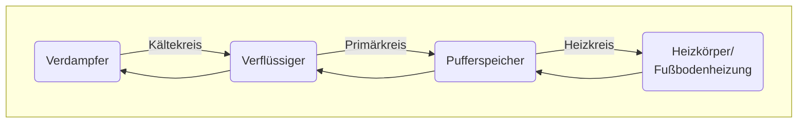

## Funktionsweise der Luft/Wasser-Wärmepumpe

Bosch CS5800/6800i und Buderus WLW176/186 sind Luft/Wasser-Wärmepumpen.
Das bedeutet, sie entziehen der Umgebungsluft Energie und übertragen diese an das Wasser im Heizungssystem.

Das gleiche Verfahren mit gegensätzlichem Effekt findet auch im Kühlschrank und in Klimaanlagen statt.
Das Herzstück ist der so genannte Kältekreislauf, in dem ein Kältemittel zirkuliert und dabei Wärme aufnimmt und abgibt.
Im **Verdampfer** wird Wärme aus der Umgebungsluft vom kalten Kältemittel aufgenommen.
Im **Verdichter** wird das Kältemittel komprimiert und dadurch erwärmt - so wie sich eine Fahrradluftpumpe beim Pumpen erwärmt.
Im **Verflüssiger** wird die Wärme an das Wasser im Heizungssystem abgegeben und kühlt dabei ab.
Durch das **Entspannungsventil** wird der Druck des Kältemittels wieder reduziert und es kühlt weiter ab - wie bei einem Deospray, das beim Betätigen kalt wird.
Dann wird das Kältemittel im Verdampfer erneut durch die Umgebungsluft aufgewärmt und der Kreis schliesst sich.

## Kreise

Im gesamten Heizungssystem gibt es aber nicht nur einen Kreislauf, sondern drei an der Zahl.

### Kältekreis

Der Kältekreis dieser Monoblock-Anlage befindet sich vollständig in der Außeneinheit.
Als Kältemittel kommt R290 (Propan) zum Einsatz.
R290 hat einen niedrigen GWP-Index von 3.
Im Vergleich haben klimaschädliche Kältemittel wie R32 einen GWP-Index von 675 und R410A sogar einen Wert von 2088.
Der [GWP-Index](https://de.wikipedia.org/wiki/Treibhauspotential) gibt an, wie stark eine Substanz über 100 Jahre verglichen mit CO2 als Treibhausgas wirkt.

Propan verdunstet bei -42.1 °C.
D.h. bei üblichen Temperaturen im deutschen Winter nimmt das Kältemittel im Verdampfer von der wärmeren Umgebungsluft Wärme auf und wird gasförmig.
Als Verdichter setzt die Wärmepumpe einen Scroll-Kompressor ein.

### Primärkreis

Der Primärkreis verläuft zwischen Außen- und Inneneinheit.
Das Transportmedium ist Wasser, das im Verflüssiger die Wärme des Kältemittels aufnimmt und diese zur Inneneinheit transportiert.
Zur hydraulischen Entkopplung kommt in der Regel ein Pufferspeicher zum Einsatz, der folgenden Zweck erfüllt:

- Entkopplung zwischen Primärkreis und Heizkreis, wenn beide unterschiedliche Volumenströme aufweisen, und als
- Wärmespeicher zum Abtauen.

In der Variante 12 MB bzw. TP70 ist ein Parallelpuffer mit Stichanbindung verbaut.
D.h. der Pufferspeicher ist über ein T-Stück eingebunden und im optimalen Fall strömt das Wasser von Primärkreis zum Heizkreis ohne die Abzweigung zum Pufferspeicher zu nutzen. Genutzt würde sie, wenn entweder:

- der Primärkreis einen höheren Volumenstrom aufweist als der Heizkreis abnehmen kann - dann zieht der Primärkreis warmes Wasser wieder direkt in den Rücklauf und die Wärmepumpe geht aus - oder
- der Primärkreis einen niedrigeren Volumenstrom aufbringt als der Heizkreis abnimmt - dann befördert der Heizkreis kälteres Wasser aus seinem Rücklauf direkt wieder in seinen Vorlauf.

Daher sollten Primär und Heizkreis die gleichen Volumenströme aufweisen.
Siehe auch [Optimierungen](/docs/optimierungen#abgleich-der-volumenströme).

### Heizkreis

Der Heizkreis durchströmt die Heizkörper und/oder Fußbodenheizung und gibt dabei Wärme an die Umgebungsluft und/oder den Estrich ab.
Das abgekühlte Wasser wird zurück in den Rücklauf des Primärkreises geführt.

Wird die Wärmepumpe auch zur Erwärmung des Warmwassers genutzt, sorgt das 3-Wege-Ventil dafür, dass zu gewissen Zeiten anstatt des Heizkreises der Warmwasserspeicher durchströmt wird (siehe auch [Warmwasseraufbereitung](/docs/einstellungen#warmwasseraufbereitung)).

## Modulation

Um die Zielvorlauftemperatur zu erreichen oder zu halten, bedarf es manchmal mehr und manchmal weniger Leistung.
Bei kalten Außentemperaturen muss mehr als ein Kilowatt elektrische Energie eingesetzt werden, um beispielsweise von -5 °C Außentemperatur den Vorlauf auf 37 °C anzuheben.
Um bei einer Außentemperatur von 12 °C den Vorlauf auf 27 °C zu heben, sind meist wenige hundert Watt ausreichend.
Würde die Wärmepumpe bei geringem Bedarf immer mit voller Leistung produziert, wäre der Sollwert für den Vorlauf schnell erreicht und die Wärmepumpe müsste abschalten.
Wenn kurz darauf die Vorlauftemperatur wieder abkühlt, müsste sie wieder kurzzeitig anspringen, um kurz darauf wieder abzuschalten.
Dieses ständige An- und Abschalten nennt man **Takten** und verringert Effizienz und erhöht den Verschleiß.
Daher ist es wünschenswert

## Abtauvorgang

Bei hoher Luftfeuchtigkeit und Temperaturen unter ca. 7 °C bildet sich Eis am Verdampfer auf der Rückseite der Außeneinheit.
Das Eis behindert den Luftstrom und dadurch wird die Effizienz beeinträchtigt.
Die Wärmepumpe beginnt dann automatisch den Abtauvorgang.



Es gibt zwei Verfahren für das Abtauen:

- Außentemperatur > 5 °C: Bereits erwärmtes Wasser aus dem Pufferspeicher und/oder der Heizungsanlage wird über den Rücklauf zum Verdampfer geleitet, der dadurch abtaut.
- Außentemperatur < 5 °C: Das 4-Wege-Ventil kehrt die Fließrichtung des heißen Kältemittels um und schickt es zum Verdampfer anstatt zum Verflüssiger (Heißgasabtauung).

Beim Abtauen wird erzeugte Wärmeenergie eingesetzt, um den Verdampfer in der Außeneinheit zu enteisen und geht somit 'verloren'. Daher ist der COP in dieser Zeit negativ.
