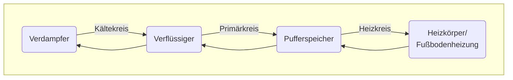

## Funktionsweise der Luft/Wasser-Wärmepumpe

Bosch CS5800/6800i und Buderus WLW176/186i sind Luft/Wasser-Wärmepumpen.
Das bedeutet, sie entziehen der Umgebungsluft Energie und übertragen diese an das Wasser im Heizungssystem.

Das gleiche Verfahren mit gegensätzlichem Effekt findet auch im Kühlschrank und in Klimaanlagen statt.
Das Herzstück ist der so genannte Kältekreislauf, in dem ein Kältemittel zirkuliert und dabei Wärme aufnimmt und abgibt.
Im **Verdampfer** wird Wärme aus der Umgebungsluft vom kalten Kältemittel aufgenommen.
Im **Verdichter** wird das Kältemittel komprimiert und dadurch erwärmt - so wie sich eine Fahrradluftpumpe beim Pumpen erwärmt.
Im **Verflüssiger** wird die Wärme an das Wasser im Heizungssystem abgegeben und kühlt dabei ab.
Durch das **Entspannungsventil** wird der Druck des Kältemittels wieder reduziert und es kühlt weiter ab - wie bei einem Deospray, das beim Betätigen kalt wird.
Dann wird das Kältemittel im Verdampfer erneut durch die Umgebungsluft aufgewärmt und der Kreis schliesst sich.

## Kreise

Im gesamten Heizungssystem gibt es aber nicht nur einen Kreislauf, sondern drei an der Zahl.

```mermaid
flowchart TD
subgraph Z[" "]
direction LR
    A(Verdampfer) -->|Kältekreis| B(Verflüssiger)
    B --> A
    B --> |Primärkreis| C(Pufferspeicher)
    C --> B
    C --> |Heizkreis| D(Heizkörper/<br/>Fußbodenheizung)
    D --> C
end
```

### Kältekreis

Der Kältekreis dieser Monoblock-Anlage befindet sich vollständig in der Außeneinheit.
Als Kältemittel kommt R290 (Propan) zum Einsatz.
R290 hat einen niedrigen GWP-Index von 3.
Im Vergleich haben klimaschädliche Kältemittel wie R32 einen GWP-Index von 675 und R410A sogar einen Wert von 2088.
Der [GWP-Index](https://de.wikipedia.org/wiki/Treibhauspotential) gibt an, wie stark eine Substanz über 100 Jahre verglichen mit CO2 als Treibhausgas wirkt.

Propan verdunstet bei -42.1 °C.
D.h. bei üblichen Temperaturen im deutschen Winter nimmt das Kältemittel im Verdampfer von der wärmeren Umgebungsluft Wärme auf und wird gasförmig.
Als Verdichter setzt die Wärmepumpe einen Rollkolbenkompressor von Hitachi-Highly ([WHP07600/WHP013300](https://de.scribd.com/document/817999055/Hitachi-Highly-Compressors)) ein.

Der Kältekreis ist auf Außentemperaturen von −22 bis 45 °C ausgelegt.
Außerhalb dieses Bereichs übernimmt der elektrische Zuheizer die Arbeit.
Steht die Außeneinheit in der prallen Sonne kann die Grenze von 45 °C im Sommer leicht überschritten werden.
Das kann dazu führen, dass das Warmwasser allein durch den Zuheizer erwärmt wird.
Wer dem entgegenwirken möchte, sollte die Warmwasserbereitung in die Morgen- oder Abendstunden legen (siehe [Einstellungen zur Warmwasserbereitung](/docs/einstellungen/#warmwasserbereitung)).
Ein Wiederanlauf erfolgt bei −17 °C bzw. +42 °C.

### Primärkreis

Der Primärkreis verläuft zwischen Außen- und Inneneinheit.
Das Transportmedium ist Wasser, das im Verflüssiger die Wärme des Kältemittels aufnimmt und diese zur Inneneinheit transportiert.
Zur hydraulischen Entkopplung kommt in der Regel ein Pufferspeicher zum Einsatz, der folgenden Zweck erfüllt:

- Entkopplung zwischen Primärkreis und Heizkreis, wenn beide unterschiedliche Volumenströme aufweisen, und als
- Wärmespeicher zum Abtauen.

In der Variante 12 MB bzw. TP70 ist ein Parallelpuffer mit Stichanbindung verbaut.
D.h. der Pufferspeicher ist über ein T-Stück eingebunden und im optimalen Fall strömt das Wasser von Primärkreis zum Heizkreis ohne die Abzweigung zum Pufferspeicher zu nutzen. Genutzt würde sie, wenn entweder:

- der Primärkreis einen höheren Volumenstrom aufweist als der Heizkreis abnehmen kann - dann zieht der Primärkreis warmes Wasser wieder direkt in den Rücklauf und die Wärmepumpe geht aus - oder
- der Primärkreis einen niedrigeren Volumenstrom aufbringt als der Heizkreis abnimmt - dann befördert der Heizkreis kälteres Wasser aus seinem Rücklauf direkt wieder in seinen Vorlauf.

Daher sollten Primär und Heizkreis die gleichen Volumenströme aufweisen.
Siehe auch [Optimierungen](/docs/optimierungen#abgleich-der-volumenströme).

### Heizkreis

Der Heizkreis durchströmt die Heizkörper und/oder Fußbodenheizung und gibt dabei Wärme an die Umgebungsluft und/oder den Estrich ab.
Das abgekühlte Wasser wird zurück in den Rücklauf des Primärkreises geführt.

Wird die Wärmepumpe auch zur Erwärmung des Warmwassers genutzt, sorgt das 3-Wege-Ventil dafür, dass zu gewissen Zeiten anstatt des Heizkreises der Warmwasserspeicher durchströmt wird (siehe auch [Warmwasserbereitung](/docs/einstellungen#warmwasserbereitung)).

## Modulation

Um die Zielvorlauftemperatur zu erreichen oder zu halten, bedarf es manchmal mehr und manchmal weniger Leistung.
Bei kalten Außentemperaturen muss mehr als ein Kilowatt elektrische Energie eingesetzt werden, um beispielsweise von -5 °C Außentemperatur den Vorlauf auf 37 °C anzuheben.
Um bei einer Außentemperatur von 12 °C den Vorlauf auf 27 °C zu heben, sind meist wenige hundert Watt ausreichend.
Würde die Wärmepumpe bei geringem Bedarf immer mit voller Leistung produziert, wäre der Sollwert für den Vorlauf schnell erreicht und die Wärmepumpe müsste abschalten.
Wenn kurz darauf die Vorlauftemperatur wieder abkühlt, müsste sie wieder kurzzeitig anspringen, um kurz darauf wieder abzuschalten.
Dieses ständige An- und Abschalten nennt man **Takten** und verringert Effizienz und erhöht den Verschleiß.

Um dem Takten entgegenzuwirken, hat die Bosch/Buderus Wärmepumpe eine so genannte Invertersteuerung, die die Drehzahl des Kompressors bis zu einem gewissen Grad dem Bedarf anpassen kann.
Wird also weniger Wärme benötigt, so regelt die Invertersteuerung die Drehzahl nach unten, wodurch weniger Wärme erzeugt und somit das Takten verhindert wird.
Doch die Invertersteuerung kann nicht beliebig weit nach unten modulieren und irgendwann ist das untere Limit erreicht und die Wärmepumpe muss takten.
Außerdem laufen die Wärmepumpen im unteren und oberen Grenzbereich oft ineffizienter.

## Abtauvorgang

Bei hoher Luftfeuchtigkeit und Temperaturen unter ca. 7 °C bildet sich Eis am Verdampfer auf der Rückseite der Außeneinheit.
Das Eis behindert den Luftstrom und dadurch wird die Effizienz beeinträchtigt.
Die Wärmepumpe beginnt dann automatisch den Abtauvorgang.

Für die so genannte Heißgasabtauung kehrt das 4-Wege-Ventil die Fließrichtung des heißen Kältemittels um und schickt es zum Verdampfer anstatt zum Verflüssiger.
Der eingefrorene Verdampfer wird kurzzeitig zum Verflüssiger und schmilzt das Eis.
Dabei entsteht viel Wasser, das über die Kondensatwanne abläuft.
Für einen guten Ablauf ist es wichtig, dass der Kondensatablauf groß genug dimensioniert ist und eisfrei bleibt.
Die Kondesatwannenheizung bzw. das dazugehörige Heizband wird bei Bedarf zugeschaltet, um Eisbildung zu verhindern.
Die gesamte Abtauung dauert ca. 4-7 Minuten.



Bosch/Buderus Wärmepumpen starten in regelmäßigen Abständen Intensivabtauungen, auch Power- oder Super-Abtauung genannt.
Diese Heißgasabtauungen dauern mit ca. 9-16 Minuten wesentlich länger.
Bei neueren Softwareversionen (ab [9.10.0](/docs/sw-versionen/#9100--970)) ist jede 5. Abtauung eine Intensivabtauung, bei älteren Versionen jede 10. Abtauung.
Wie der Name vermuten lässt, ist diese Abtauung intensiver, um hartnäckige Eisreste abzuschmelzen.
Oft sieht man große Dampfwolken aufsteigen.
Dafür werden bis zu 2 kWh Wärme benötigt.

Beim Abtauen wird erzeugte Wärmeenergie eingesetzt, um den Verdampfer in der Außeneinheit zu enteisen und geht somit 'verloren'. Daher ist der COP in dieser Zeit negativ.

## Energiemonitoring und Stromverbrauch

Für die Bewertung ist zunächst die **Bilanzgrenze** wichtig: Bei Bosch/Buderus fließen neben Verdichter und Ventilator auch Elektronik und Regelung, Kurbelgehäuseheizung, Standby-Verbrauch und elektrischer Zuheizer in den Stromverbrauch ein.
Bosch/Buderus bilanziert die angezeigte Arbeitszahl vergleichsweise streng.
Viele Nebenverbraucher werden dem eingesetzten Strom zugerechnet und die beim Abtauen verbrauchte Wärme wird von der erzeugten Wärme abgezogen.
Andere Hersteller verwenden teilweise engere Bilanzgrenzen oder ziehen die "verlorene" Abtauenergie nicht ab.
Dadurch können Bosch/Buderus-Anlagen auf dem Display eine schlechtere Arbeitszahl aufweisen, obwohl sie technisch nicht weniger effizient arbeiten.

Das Energiemonitoring der Wärmepumpe basiert nicht auf realen Messwerten, sondern wird aus Betriebsdaten berechnet.
Im Standby zeigt das Energiemonitoring konstant **25 W** an.
Das ist ein gemittelter Rechenwert und nicht die reale Leistung.
Praxismessungen der realen Leistung ergeben ungefähr folgende Werte für Innen- und Außeneinheit zusammen:

| Betriebszustand | Kleine Außeneinheit (4/5/7) | Große Außeneinheit (10/12) |
|---|---:|---:|
| Normaler Standby | 12–16 W | 14–18 W |
| Bei aktiver Kurbelgehäuseheizung zusätzlich | 70–85 W | 110–125 W |

Im normalen Standby entfällt ungefähr die Hälfte des Gesamtverbrauchs auf die Innen- und die andere Hälfte auf die Außeneinheit.
Läuft zusätzlich eine der Pumpen _PC0_ oder _PC1_ (Grundfos UPM4L (K) LIN), kommen je nach Drehzahl jeweils etwa 10–75 W hinzu.

Die **Kurbelgehäuseheizung**, auch Kompressor- oder Ölsumpfheizung genannt, hält den abgeschalteten Verdichter warm.
Dadurch wird verhindert, dass sich zu viel Kältemittel im Verdichteröl löst und beim nächsten Start die Schmierung beeinträchtigt.
Wie häufig sie aktiviert wird, hängt von der Softwareversion und den Temperaturen ab. Mit neueren Softwareständen ab [9.6.0 / 9.6.1](https://bosch-buderus-wp.github.io/docs/sw-versionen/#960--961) wurde die Aktivierung vor allem im Sommer reduziert.

Wichtig ist noch zu wissen, dass der Stromverbrauch dem Energiemonitoring der Heizung zugerechnet wird, wenn sich die Anlage im Standby befindet.
Dadurch tritt auch im Sommer Stromverbrauch fürs Heizen auf, was teilweise zu Irritationen führt.
Außerdem ist zu beachten, dass in der Übergangszeit und im Sommer, wenn nur das Warmwasser bereitet wird, die Arbeitszahl oft relativ niedrig ist.
Grund hierfür ist, dass die relativ gute Arbeitszahl aus dem zeitlich reduzierten Heiz-/Warmwasser-/Kühlbetrieb durch den Standbyverbrauch während des Nichtbetriebs schlechter wird.
Auch bei kleinen Anlagen mit insgesamt wenig Stromverbrauch im Betrieb führt der im Verhältnis hohe Systemverbrauch zu einer schlechteren Arbeitszahl.

## Weiterführende Grundlagen

[{:width="100px"}](https://link.amazon/B09tnIJmm){: rel="sponsored"}
{: .align-right}

Wer Funktionsweise, Auslegung und effizienten Betrieb von Wärmepumpen über diese technische Übersicht hinaus vertiefen möchte, findet im Buch [Alles, was Sie über Wärmepumpen wissen müssen](https://link.amazon/B09tnIJmm){: rel="sponsored"} von Energiesparkommissar Carsten Herbert einen verständlichen Einstieg für Laien und angehende Fachleute.

*Affiliate-Link: Bei einem Kauf erhalte ich möglicherweise eine Provision. Für dich entstehen keine zusätzlichen Kosten.*
