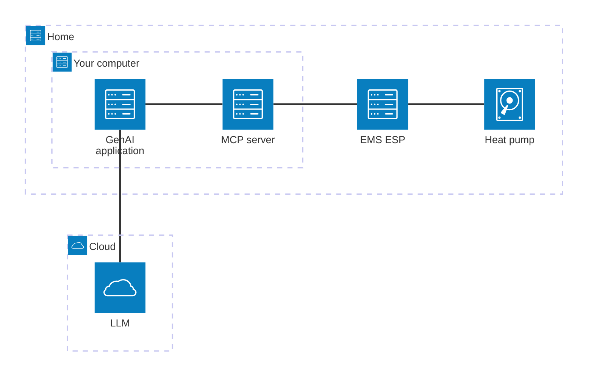



Are you already using Gen-AI applications such as [Anthropic Claude](https://claude.ai/)?
Then the [EMS-ESP MCP server](https://github.com/bosch-buderus-wp/emsesp-mcp-server) might be interesting for you.
The MCP server enables the Large Language Model (LLM) to access your heat pump in order to answer questions such as:

- How warm is our domestic hot water right now?
- How efficiently is domestic hot water produced?
- How much power is my heat pump currently consuming?

In addition to these simple queries of entities, more complex requests are also possible, such as:

- Show me all domestic hot water settings (start, stop & charging delta) for the various operating modes (Comfort, Eco, Eco+, One-time charging & Disinfection) as a table!
- Display the heating curve in a chart ...

[](https://i.ibb.co/0jzTstC7/Claude-Heatcurve.png)

To reduce the amount of writing for you, the last two requests are already stored as _prompts_.
In Claude Desktop, you can find stored prompts by pressing `+`.

## Installation

Claude Desktop offers the simplest installation—in the free version as well.
To do this, download this [DXT Desktop Extension](https://github.com/bosch-buderus-wp/emsesp-mcp-server/releases/latest/download/emsesp-mcp-server.dxt).
Then open the settings in Claude Desktop, click on `Extensions`, and drag the downloaded DXT file into the window.
Then click `Install` and enter the URL under which your [EMS-ESP](/en/docs/smarthome/) gateway can be reached in the local network in the configuration.
And then you can get started!

In many other Gen-AI applications, such as Github Copilot, you have to add the following configuration in the settings:

```
"emsesp": {
  "type": "stdio",
  "command": "npx",
  "args": [
    "-y",
    "github:bosch-buderus-wp/emsesp-mcp-server"
  ],
  "env": {
    "EMS_ESP_URL": "http://ems-esp.local"
  }
}
```

## Technical details

{: .notice--info}
_What is an MCP server?_

MCP stands for [Model Context Protocol](https://modelcontextprotocol.io/) and was published by Anthropic in November 2024 to enrich Large Language Models (LLMs) with contextual information.
In this case, the context consists of the entities of the heat pump.
In response to the request _"How warm is the domestic hot water right now"_, the LLM retrieves the [hptw1](https://bosch-buderus-wp.github.io/en/docs/smarthome/entities/#messwerte-1) entity and creates a corresponding response in text form.
However, the LLM can answer more than just trivial requests like this.
In response to the request _"How efficiently is domestic hot water produced?"_, the LLM divides the [dhw.nrg](https://bosch-buderus-wp.github.io/en/docs/smarthome/entities/#mit-2-nachkommastellen) entity by [dhw.meter](https://bosch-buderus-wp.github.io/en/docs/smarthome/entities/#mit-2-nachkommastellen) and thus returns the COP/performance factor.

{: .notice--info}
_Can the LLM access my heat pump without my involvement, and what data is made available to the LLM?_

If the LLM wants to access your heat pump via EMS-ESP, a permission request appears in the Gen-AI application.
You can then decide for yourself whether you want to allow the request once or permanently.
I recommend that you do not allow control access permanently, at least.

Data is transmitted to the provider's LLM only if you confirm the permission request.
The data consists of selected entities from your heat pump.
No other data, including personal data, is transmitted.



{: .notice--info}
_Which other Gen-AI applications can I use?_

Here you can find an overview of all Gen-AI applications that support MCP: [MCP Clients](https://modelcontextprotocol.io/clients).
The MCP server for EMS-ESP should be compatible with all MCP clients that support _tools_. If not, feel free to open an [issue](https://github.com/bosch-buderus-wp/emsesp-mcp-server/issues).
