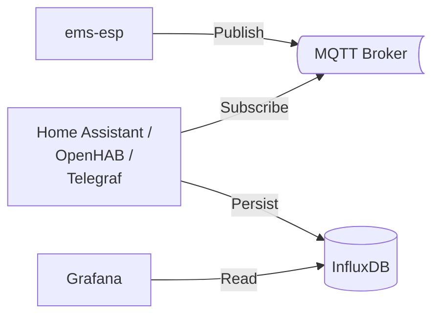

Below you will find instructions on how to integrate the Bosch CS5800/6800i or Buderus WLW176/186i into open smart home systems such as [OpenHAB](/en/docs/smarthome/openhab/) or [Home Assistant](/en/docs/smarthome/home-assistant/), or energy management systems such as [evcc](/en/docs/smarthome/evcc/).
It also describes how to visualize the measured values in [Grafana](/en/docs/smarthome/grafana/), integrate the heat pump into [Gen-AI](/en/docs/smarthome/ai/) applications such as Anthropic Claude, or simply receive [notifications](/en/docs/smarthome/notifications/) from the heat pump on your smartphone.

## EMS-ESP

Unfortunately, Bosch/Buderus heat pumps do not offer an official interface for retrieving measured values or changing settings.

Fortunately, there is the open-source project [ems-esp](https://emsesp.org).
If you do not want to build the hardware yourself, you can purchase hardware already flashed with _ems-esp_ from [BBQKees](https://bbqkees-electronics.nl/?lang=de).
I decided to use the [ BBQKees Gateway E32 V2.2](https://bbqkees-electronics.nl/product/gateway-e32-v2-ethernet-wifi-ausgabe-v2-kit/?lang=de).

### Installation

The easiest way to connect the _ems-esp_ gateway to your heat pump is via the service socket.
In my Bosch CS 6800i AW 12 MB, the service socket is located on the left side of the electronics box.
To do this, open the front panel of the indoor unit by removing the screw on the top and pressing the two locking buttons.
To access the service socket, loosen the screw at the top and fold out the gray electronics box.
Then first connect the cable to the _ems-esp_ gateway and, in the next step, plug the cable into the service socket (in exactly this order).
You can then reassemble everything and guide the cable through the small gap at the top left between the front panel and housing.

<figure class="half">
  <a href="https://i.ibb.co/hFFtpd81/BBQKees-Gateway-E32-V2-2.jpg">
    
  </a>
  <a href="/assets/images/Servicebuchse.jpg">
    
  </a>
</figure>

To avoid sporadic connection problems, you should use a high-quality connection cable and keep the gateway outside the indoor unit.

### Setup

As soon as the gateway is connected to your heat pump, it starts automatically and opens a Wi-Fi network named _'ems-esp'_.
Connect your computer or smartphone to this Wi-Fi network.
When you then open the address [http://192.168.4.1](http://192.168.4.1) in your browser, the _ems-esp_ web interface appears.
The default login credentials are _'admin'_ with the password _'admin'_.

[](/assets/images/EMS-ESP.png)

You must now set up your home Wi-Fi network under [Settings &rarr; Network](http://ems-esp/settings/network/settings).
You can then switch your computer/smartphone back to your home Wi-Fi network.

Your _ems-esp_ gateway should now be accessible at [http://ems-esp](http://ems-esp) or [http://ems-esp.local](http://ems-esp.local).
You can access the REST API at `/api`:

```shell
curl http://ems-esp/api/thermostat/manualtemp
> {"name":"manualtemp","fullname":"HK1 manuelle Temperatur","circuit":"hc1","value":21.5,"type":"number","min":0,"max":127,"uom":"°C","readable":true,"writeable":true,"visible":true}
```

### Reading/setting entities

In the web interface, your heat pump appears with 3 devices:

- **XCU_THH/CS\*800i, Logatherm WLW\*** (Boiler): the heat pump controller \
  The boiler controls all important heat pump functions and provides most of the entities.
- **HMI800.2/Rego 3000, UI800, Logamatic BC400** (Thermostat): the control panel on the indoor unit \
  The thermostat is essentially responsible for determining the flow temperature and a few other settings.
- **K30RF/WiFi module** (Gateway Module): optional Wi-Fi module for connecting to the Bosch/Buderus app

The entities that can be read from the devices are either measured values (e.g. flow temperature), status information (e.g. domestic hot water production active), settings (e.g. desired room temperature), or commands (e.g. start disinfection).
In my [entity overview](/en/docs/smarthome/entities/), you will find a list with explanations of the most important entities.

You can now get started and view and configure the entities via the web interface.
And via the REST API, you can connect the following extensions:

- [Notifications](/en/docs/smarthome/notifications/) to receive push notifications on your smartphone when statuses change
- Connect energy management systems such as [evcc](/en/docs/smarthome/evcc/)
- Use [Gen-AI](/en/docs/smarthome/ai/) applications such as Anthropic Claude to evaluate your entities.

The next section explains how to connect smart home systems via MQTT.

## MQTT

MQTT is suitable for exchanging data between _ems-esp_ and a smart home system.
For this, you need an MQTT broker such as [Mosquitto](https://mosquitto.org/), which is already provided as an optional extension in many smart home systems.
In Home Assistant and OpenHAB, Mosquitto can easily be installed via the corresponding [add-on](https://github.com/home-assistant/addons/blob/master/mosquitto/DOCS.md).
Communication with _evcc_ works via the REST API of _ems-esp_.
Therefore, you do not need MQTT for _evcc_.



For _ems-esp_ to send the measured values to the MQTT broker, you must enable this under _Settings &rarr; MQTT&nbsp;Settings_ and enter the _Broker Address_, as well as the _Username_ and _Password_.
You should also enable _Enable MQTT Discovery_, because otherwise you will have to create all entities manually.

[](/assets/images/EMS-ESP-MQTT.png)

If you do not yet have an MQTT broker, communication will of course only work once you have installed the MQTT add-on in your smart home system.
More information can be found in the following sections:

- [Home Assistant](/en/docs/smarthome/home-assistant/)
- [OpenHAB](/en/docs/smarthome/openhab/)
- [Grafana](/en/docs/smarthome/grafana/)
