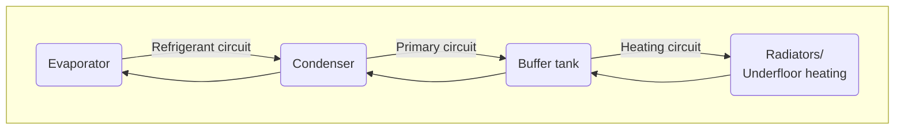

## How the air-to-water heat pump works

Bosch CS5800/6800i and Buderus WLW176/186i are air-to-water heat pumps.
This means that they extract energy from the ambient air and transfer it to the water in the heating system.

The same process with the opposite effect also takes place in refrigerators and air-conditioning systems.
The heart of the system is the so-called refrigeration cycle, in which a refrigerant circulates, absorbing and releasing heat.
In the **evaporator**, heat from the ambient air is absorbed by the cold refrigerant.
In the **compressor**, the refrigerant is compressed and thereby heated—as a bicycle pump heats up when pumping.
In the **condenser**, the heat is transferred to the water in the heating system, causing the refrigerant to cool down.
The **expansion valve** reduces the pressure of the refrigerant again, causing it to cool further—as with a deodorant spray that becomes cold when used.
The refrigerant is then heated again in the evaporator by the ambient air, and the cycle closes.

## Circuits

However, the entire heating system does not contain just one circuit, but three.

### Refrigerant circuit

The refrigerant circuit of this monoblock system is located entirely in the outdoor unit.
R290 (propane) is used as the refrigerant.
R290 has a low GWP index of 3.
By comparison, climate-damaging refrigerants such as R32 have a GWP index of 675, while R410A has a value of 2088.
The [GWP index](https://de.wikipedia.org/wiki/Treibhauspotential) indicates how strongly a substance acts as a greenhouse gas over 100 years compared with CO2.

Propane evaporates at −42.1 °C.
This means that at typical temperatures in the German winter, the refrigerant absorbs heat from the warmer ambient air in the evaporator and becomes gaseous.
The heat pump uses a Hitachi-Highly rotary compressor ([WHP07600/WHP013300](https://de.scribd.com/document/817999055/Hitachi-Highly-Compressors)) as its compressor.

The refrigerant circuit is designed for outdoor temperatures from −22 to 45 °C.
Outside this range, the electric backup heater takes over.
If the outdoor unit is in direct sunlight, the limit of 45 °C can easily be exceeded in summer.
This can cause the domestic hot water to be heated solely by the electric backup heater.
Anyone wishing to counteract this should schedule domestic hot water production for the morning or evening hours (see [Domestic hot water production settings](/en/docs/settings/#warmwasserbereitung)).
Restarting occurs at −17 °C and +42 °C, respectively.

### Primary circuit

The primary circuit runs between the outdoor and indoor units.
The transport medium is water, which absorbs the heat of the refrigerant in the condenser and transports it to the indoor unit.
A buffer tank is generally used for hydraulic separation and serves the following purposes:

- Separation between the primary circuit and heating circuit when both have different flow rates, and as a
- heat reservoir for defrosting.

In the 12 MB and TP70 variants, a parallel buffer tank with branch connection is installed.
This means that the buffer tank is integrated via a T-piece and, under optimal conditions, the water flows from the primary circuit to the heating circuit without using the branch to the buffer tank. It would be used if either:

- the primary circuit has a higher flow rate than the heating circuit can accept—in this case, the primary circuit draws warm water directly back into the return and the heat pump switches off—or
- the primary circuit provides a lower flow rate than the heating circuit draws—in this case, the heating circuit conveys colder water from its return directly back into its flow.

Therefore, the primary and heating circuits should have the same flow rates.
See also [Optimizations](/docs/optimierungen#abgleich-der-volumenströme).

### Heating circuit

The heating circuit flows through the radiators and/or underfloor heating and releases heat to the ambient air and/or screed.
The cooled water is routed back into the return of the primary circuit.

If the heat pump is also used to heat domestic hot water, the 3-way valve ensures that at certain times the domestic hot water tank is supplied instead of the heating circuit (see also [Domestic hot water production](/docs/einstellungen#warmwasserbereitung)).

## Modulation

Reaching or maintaining the target flow temperature sometimes requires more and sometimes less output.
At cold outdoor temperatures, more than one kilowatt of electrical energy must be used to raise the flow temperature from an outdoor temperature of −5 °C to 37 °C, for example.
At an outdoor temperature of 12 °C, a few hundred watts are usually sufficient to raise the flow temperature to 27 °C.
If the heat pump always produced full output when demand was low, the target flow temperature would quickly be reached and the heat pump would have to switch off.
If the flow temperature cooled down again shortly afterward, it would have to start up again briefly, only to switch off again shortly afterward.
This constant switching on and off is called **cycling** and reduces efficiency while increasing wear.

To counteract cycling, the Bosch/Buderus heat pump has a so-called inverter control system that can adjust the compressor speed to the demand to a certain extent.
If less heat is required, the inverter control system reduces the speed, producing less heat and thereby preventing cycling.
However, the inverter control system cannot modulate downward indefinitely, and eventually the lower limit is reached and the heat pump must cycle.
In addition, heat pumps often operate less efficiently in the lower and upper limit ranges.

## Defrost cycle

At high humidity and temperatures below approximately 7 °C, ice forms on the evaporator at the rear of the outdoor unit.
The ice obstructs the airflow and consequently impairs efficiency.
The heat pump then automatically begins the defrost cycle.

For the so-called hot-gas defrosting, the 4-way valve reverses the flow direction of the hot refrigerant and sends it to the evaporator instead of the condenser.
The frozen evaporator temporarily becomes the condenser and melts the ice.
This produces a great deal of water, which drains through the condensate pan.
For proper drainage, it is important that the condensate drain is adequately sized and remains free of ice.
The condensate pan heater or the associated heating tape is switched on as needed to prevent ice formation.
The entire defrost cycle takes approximately 4–7 minutes.



Bosch/Buderus heat pumps start intensive defrost cycles at regular intervals, also known as power or super defrost cycles.
These hot-gas defrost cycles last considerably longer, approximately 9–16 minutes.
With newer software versions (from [9.10.0](/en/docs/software-versions/#9100--970)), every fifth defrost cycle is an intensive defrost cycle; with older versions, every tenth defrost cycle is intensive.
As the name suggests, this defrost cycle is more intensive in order to melt stubborn ice residue.
Large clouds of steam can often be seen rising.
This requires up to 2 kWh of heat.

During defrosting, generated heat energy is used to de-ice the evaporator in the outdoor unit and is therefore “lost”. The COP is consequently negative during this period.

## Energy monitoring and power consumption

For the assessment, the **system boundary** is important initially: In Bosch/Buderus systems, the power consumption includes not only the compressor and fan, but also the electronics and control system, crankcase heater, standby consumption, and electric backup heater.
Bosch/Buderus calculates the displayed performance factor comparatively strictly.
Many auxiliary consumers are attributed to the electricity used, and the heat consumed during defrosting is deducted from the heat generated.
Other manufacturers sometimes use narrower system boundaries or do not deduct the “lost” defrost energy.
As a result, Bosch/Buderus systems may show a lower performance factor on the display even though they are not technically operating less efficiently.

The heat pump’s energy monitoring is not based on actual measured values but is calculated from operating data.
In standby mode, the energy monitoring constantly displays **25 W**.
This is an averaged calculated value and not the actual power.
Practical measurements of the actual power for the indoor and outdoor units together produce approximately the following values:

| Operating state | Small outdoor unit (4/5/7) | Large outdoor unit (10/12) |
|---|---:|---:|
| Normal standby | 12–16 W | 14–18 W |
| Additional power with active crankcase heater | 70–85 W | 110–125 W |

In normal standby mode, approximately half of the total consumption is attributable to the indoor unit and the other half to the outdoor unit.
If one of the _PC0_ or _PC1_ pumps (Grundfos UPM4L (K) LIN) is also running, approximately 10–75 W is added for each pump, depending on the speed.

The **crankcase heater**, also called a compressor or oil sump heater, keeps the switched-off compressor warm.
This prevents too much refrigerant from dissolving in the compressor oil and impairing lubrication at the next start.
How often it is activated depends on the software version and temperatures. With newer software versions from [9.6.0 / 9.6.1](https://bosch-buderus-wp.github.io/en/docs/software-versions/#960--961), activation was reduced, particularly in summer.

It is also important to know that power consumption is attributed to the heating system’s energy monitoring when the system is in standby mode.
As a result, heating-related power consumption also occurs in summer, which can sometimes cause confusion.
It should also be noted that during the transitional season and in summer, when only domestic hot water is produced, the performance factor is often relatively low.
The reason is that the relatively good performance factor during the reduced-time heating/domestic-hot-water/cooling operation is diminished by standby consumption during periods of inactivity.
Even in small systems with low overall power consumption during operation, the relatively high system consumption results in a lower performance factor.

## Further background information

[{:width="100px"}](https://link.amazon/B09tnIJmm){: rel="sponsored"}
{: .align-right}

Anyone wishing to learn more about the operation, design, and efficient operation of heat pumps beyond this technical overview will find an accessible introduction for non-specialists and aspiring professionals in the book [Alles, was Sie über Wärmepumpen wissen müssen](https://link.amazon/B09tnIJmm){: rel="sponsored"} by energy-saving commissioner Carsten Herbert.

*Affiliate link: If you make a purchase, I may receive a commission. You will not incur any additional costs.*
